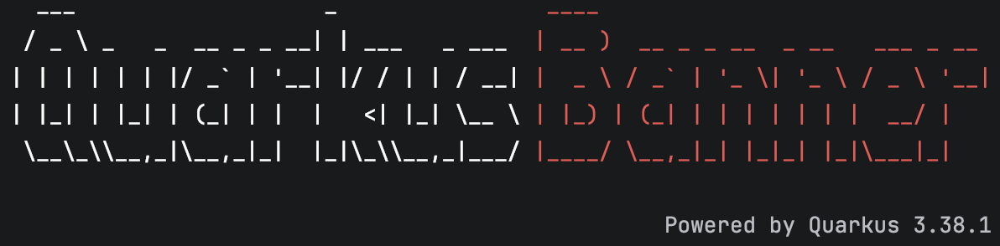

# Quarkus Banner

[](https://central.sonatype.com/artifact/io.quarkiverse.banner/quarkus-banner-parent)
[](https://github.com/quarkiverse/quarkus-banner/actions/workflows/build.yml)
[](https://www.apache.org/licenses/LICENSE-2.0)

Generate a **colourful** [FIGlet](https://en.wikipedia.org/wiki/FIGlet) ASCII-art startup banner for your Quarkus application — rendered at
**build time** from a piece of text and a font, painted in the ANSI colours you choose, and shown at start-up the same way Quarkus renders its own
banner.

<p align="center">
  
</p>

### Highlights

- 🎨 **Colour, including multi-colour banners.** Set a foreground and background colour, or colour parts of the text inline with
  `{colour}` markers — `text={red}My {bright-cyan}Service` — and the banner is painted per-word with kerning preserved.
- 🖥️ **Console-aware.** Colour is only emitted when the terminal supports it; log files and colour-less consoles get a clean, plain banner.
- 🔤 **~250 bundled fonts**, selectable by name and validated at build time.
- 🧩 **Dev UI preview** to try text, fonts and colours live — and print the result straight to the running app's console.
- 📦 **Zero third-party rendering dependencies** — banners are drawn by a small, self-contained FIGlet renderer bundled with the extension
  (see [below](#rendering)).

## How it works

At build time the extension renders your text into ASCII art with one of the ~250 bundled FIGlet fonts and installs it as a `TextBannerFormatter` on
the console log handler — the exact mechanism Quarkus uses for its own banner. This means:

- the banner appears as a header above the log output and honours your console format and colour settings;
- Quarkus' built-in banner is replaced automatically (you don't need to set `quarkus.banner.enabled=false`);
- if generation is disabled, or the text can't be rendered, the default Quarkus banner is left untouched.

Because the banner is baked at build time, changing the text or font requires a rebuild (or a live-reload in dev mode). In dev
mode the banner is repainted only when it actually changes — the first start always shows it, and after that it is reprinted
only when the rendered banner differs (a new `text`, `font` or `power-by`), so ordinary hot reloads don't repeat it. As with all
Quarkus live reload, the change is applied on the next request to the application.

## Installation

Add the dependency to your `pom.xml`:

```xml

<dependency>
    <groupId>io.quarkiverse.banner</groupId>
    <artifactId>quarkus-banner</artifactId>
    <version>{version}</version>
</dependency>
```

For Gradle, add to your `build.gradle`:

```gradle
implementation("io.quarkiverse.banner:quarkus-banner:{version}")
```

## Usage

Configure the banner in `application.properties`:

```properties
# The text to render (defaults to quarkus.application.name, or "Quarkus")
quarkus.banner-generator.text=My Service

# One of the bundled fonts (defaults to "standard")
quarkus.banner-generator.font=doom

# Optional ANSI colours (applied only when the console supports colour)
quarkus.banner-generator.color=bright-cyan
quarkus.banner-generator.background-color=blue

# ...or colour parts of the text inline with {colour} markers, for a multi-colour banner:
quarkus.banner-generator.text={red}My {bright-cyan}Service
```

## Configuration

All properties are fixed at build time.

| Property                            | Type      | Default                    | Description                                                                                                       |
|-------------------------------------|-----------|----------------------------|-------------------------------------------------------------------------------------------------------------------|
| `quarkus.banner-generator.enabled`  | `boolean` | `true`                     | Whether the banner is generated at build time. When `false`, Quarkus' own banner applies as usual.                |
| `quarkus.banner-generator.text`     | `string`  | `quarkus.application.name` | The text to render as a FIGlet banner.                                                                            |
| `quarkus.banner-generator.font`     | `enum`    | `standard`                 | The bundled font to use (see [Fonts](#fonts)). Matched case-insensitively; an unknown font is a build-time error. |
| `quarkus.banner-generator.power-by` | `boolean` | `true`                     | Append a right-aligned `Powered by Quarkus <version>` tagline under the banner.                                   |
| `quarkus.banner-generator.color`    | `enum`    | `default`                  | Foreground (font) colour. One of the standard ANSI colours or their `bright-` variants; `default` leaves the terminal colour. |
| `quarkus.banner-generator.background-color` | `enum` | `default`              | Background colour filling the banner box. Same value set as `color`.                                             |

## Colour

The banner can be painted in ANSI colour — a single colour, or several at once.

**One colour** for the whole banner (foreground, background, or both):

```properties
quarkus.banner-generator.color=bright-cyan
quarkus.banner-generator.background-color=blue
```

**Multiple colours** — embed `{colour}` markers directly in the text and each part is painted independently, with the FIGlet kerning
preserved so the letters still tuck together:

```properties
quarkus.banner-generator.text={red}My {bright-cyan}Service
```

- Markers set the **foreground**; `background-color` still fills the whole box behind every colour.
- `{default}` returns to the terminal's own colour, and a `{token}` that isn't a colour is left in the text verbatim.
- Accepted colours: `black`, `red`, `green`, `yellow`, `blue`, `magenta`, `cyan`, `white`, `orange`, and their `bright-*` variants
  (matched case-insensitively); any `#rgb` / `#rrggbb` **hex** colour (e.g. `{#ff8800}` or `color=#33ccff`); or `default`. Hex and
  `orange` use 24-bit truecolor, so they need a truecolor-capable terminal.

**Colour is only emitted when the console supports it** — governed by `quarkus.console.color` (and, when unset, terminal detection plus the
`NO_COLOR` convention). Both a colour and a plain version of the banner are produced at build time, and the runtime installs whichever suits
the console, so log files and colour-less terminals never see stray escape codes.

## Multiple lines

Split the text into lines with `\n` (a literal backslash-n, which is what a `.properties` value delivers — an actual newline works too). Each
line is rendered as its own FIGlet block and the blocks are stacked:

```properties
quarkus.banner-generator.text={bright-white}Quarkus\n{red}Banner
quarkus.banner-generator.alignment=center
quarkus.banner-generator.line-spacing=1
```

- `alignment` = `left` (default), `center`, or `right` — positions each line within the width of the widest line.
- `line-spacing` (default `1`) is the number of blank rows between stacked lines, so a descender like `g` or `j` on one line doesn't touch
  the line below.
- Per-line inline `{colour}` markers and the background box still apply; a background fills the banner (including the gaps between lines) but
  never the `Powered by Quarkus` tagline.

## Fonts

`quarkus.banner-generator.font` must be one of the **246 FIGlet fonts** bundled with, and tested against, this extension — for example `standard`,
`slant`, `doom`, `big`, `colossal`, `banner3-D` or `3d_diagonal`. Only bundled fonts are accepted; arbitrary classpath resources, file paths and
remote URLs are intentionally not supported, and typos are caught at build time.

The full list of fonts and their authors is in [FIGLET-FONTS.md](FIGLET-FONTS.md).

> **Licensing note:** the bundled fonts originate from the FIGlet font collection and are authored by many
> individuals under varied terms. Each font's original header (including author credit) is preserved in the
> `.flf` file; they are redistributed on that basis and are **not** relicensed under this extension's
> Apache-2.0 license. Review individual font headers before redistributing.

## Dev mode

Quarkus' interactive dev console (`quarkus:dev`) repaints its pinned prompt and can erase the start-up banner on narrow terminals — this affects
Quarkus' own banner too, not just this extension. If you want the banner to survive in dev mode regardless of terminal width, use the basic console
**for the dev profile only**:

```properties
%dev.quarkus.console.basic=true
```

This has no effect in production (the interactive console only runs in dev and test modes).

### Dev UI

In dev mode the extension adds a **Quarkus Banner** card to the Dev UI (`http://localhost:8080/q/dev-ui/`). Its **Preview**
page lets you type any text (including inline `{colour}` markers), pick any bundled font, choose the foreground and background
colours, and toggle the *Powered by Quarkus* tagline — all with a live, colour-accurate preview, no restart and no HTTP request
needed. A **Print to log** button renders the banner straight to the application console. Because a build-time config change only
takes effect on the next request in dev mode, the Dev UI is the quickest way to try fonts, text and colours while iterating.

## Rendering

Banners are drawn by a small, self-contained FIGlet renderer bundled with the extension — a clean-room implementation of the public
FIGfont v2 standard, validated byte-for-byte against the reference `figlet` program. It carries **no third-party rendering library**,
so the extension has no non-Apache runtime or build dependencies for rendering, and nothing extra ends up on your classpath.

## Documentation

Full documentation lives in the `docs/` directory and is published to
<https://docs.quarkiverse.io/quarkus-banner/dev/>.

## License

Apache License 2.0 — see [LICENSE](LICENSE). Bundled FIGlet fonts retain their original terms; see
[FIGLET-FONTS.md](FIGLET-FONTS.md).
